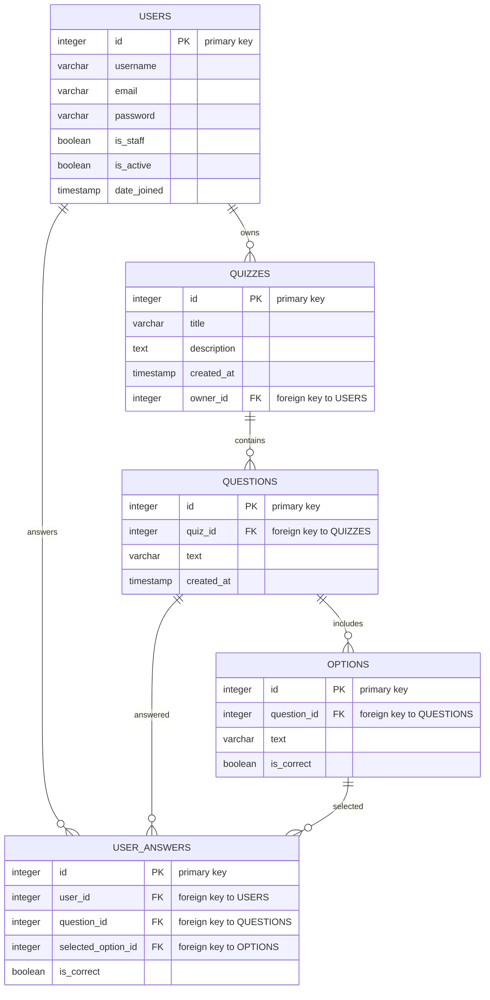
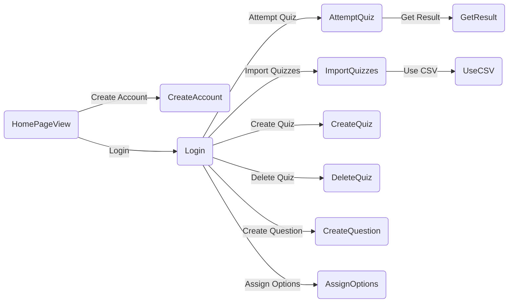

# Quizzy: Your Ultimate Quiz Preparation Tool 📚✨

    

## Graphical Abstract 🎨
### Flow:

### Data Structure:

**Feeling puzzled about preparing for your exams? Say goodbye to confusion with Quizzy, the charming practice buddy designed to make your test prep as easy as pie!** 🍰

## ✨ Getting Started
Curious to dive in? Take a peek at Quizzy in action. Just hop over to ➔ [Demo Web APP](http://getbackwork.pythonanywhere.com/quiz)

## 🚀 Video Demo
#TODO

## 🎯 Purpose
**Quizzy** is not just a tool; it's your personal cheerleader- ensuring you're sprint-ready for any test coming your way. Whether it's acing your school exams or smashing that professional certification, Quizzy's got your back!

## 💧 Software Development Process: The Classic Waterfall Model
We embraced the time-honored Waterfall model, valuing its linear, cascading essence which aligns with our crisp and clear project outline.

### Why Waterfall? Here's the splash!
* Structured and Steady: With a robust foundation phase and methodical overhead, we're on track to create Quizzy magic without any hitches.
* A predictable playbook: No room for guesswork or improvisation, we're sticking to the script to craft an outstanding quiz experience for you.

## 🎯 Target Market Snapshot
From bustling students to career-boosting professionals, Quizzy is the perfect prep companion for anyone with an appetite for knowledge and a hunger for success.

## 🛠️ Software Development Saga

### The Creation Odyssey
Following the Waterfall's legacy, we delved through stages from contemplation to realization:
* **Blueprinting Dreams:** Sculpting out Quizzy's DNA from authentication marvels to progress tracking victories.
* **Artful Designing:** Choreographing a symphony of screens and data dances, enriching Django's soul with our very own models and view masterpieces.
* **Crafting the Core:** Breathing life into Quizzy with the real deal - CRUD spells, question conjurations, and CSV enchantments.
* **Testing Triumphs:** Sending Quizzy through trials and tribulations with our rigorous test alchemists ensuring everything is tickety-boo.
* **Global Unveiling:** Setting the stage with servers, database glam, and static showstoppers, we're red-carpet ready for Quizzy's grand entrance.

### The Visioneers
Here's to the dream weavers behind Quizzy:
* **Kenny Kou (P2204767)**: The code whisperer for views, urls, and models.
* **Matthew NG (P2204935)**: The creative crusader for designing templates that aren't just visually pleasing but also intuitively navigable.
* **Alex Leong (P2204876)**: The maestro of demos, graphic and documents, a support hero, and a visionary for now, then and tomorrow's Quizzy.

### The March of Progress
* **Day 1:** Conceiving the grand design.
* **Day 2~3:** Breathing life into the creation.
* **Day 4:** Triumphing over bugs and glitches.
* **Day 5:** The final review; a toast to completion.

### Algorithm
#### Overall:

#### Import Quizzes With CSV:
<div class="mxgraph" style="max-width:100%;border:1px solid transparent;" data-mxgraph="{&quot;highlight&quot;:&quot;#0000ff&quot;,&quot;nav&quot;:true,&quot;resize&quot;:true,&quot;toolbar&quot;:&quot;zoom layers tags lightbox&quot;,&quot;edit&quot;:&quot;_blank&quot;,&quot;xml&quot;:&quot;&lt;mxfile host=\&quot;app.diagrams.net\&quot; modified=\&quot;2024-04-20T13:19:36.864Z\&quot; agent=\&quot;Mozilla/5.0 (Windows NT 10.0; Win64; x64) AppleWebKit/537.36 (KHTML, like Gecko) Chrome/124.0.0.0 Safari/537.36\&quot; etag=\&quot;M2HFbO8oOKc3_RfpbPco\&quot; version=\&quot;24.2.7\&quot; type=\&quot;device\&quot;&gt;\n  &lt;diagram name=\&quot;第 1 页\&quot; id=\&quot;p7xz57uQPpWJcO2bHpKx\&quot;&gt;\n    &lt;mxGraphModel dx=\&quot;1221\&quot; dy=\&quot;665\&quot; grid=\&quot;1\&quot; gridSize=\&quot;10\&quot; guides=\&quot;1\&quot; tooltips=\&quot;1\&quot; connect=\&quot;1\&quot; arrows=\&quot;1\&quot; fold=\&quot;1\&quot; page=\&quot;1\&quot; pageScale=\&quot;1\&quot; pageWidth=\&quot;827\&quot; pageHeight=\&quot;1169\&quot; math=\&quot;0\&quot; shadow=\&quot;0\&quot;&gt;\n      &lt;root&gt;\n        &lt;mxCell id=\&quot;0\&quot; /&gt;\n        &lt;mxCell id=\&quot;1\&quot; parent=\&quot;0\&quot; /&gt;\n        &lt;mxCell id=\&quot;uiS2l8XWeHpGsUy73MTD-10\&quot; style=\&quot;edgeStyle=orthogonalEdgeStyle;rounded=0;orthogonalLoop=1;jettySize=auto;html=1;exitX=0.5;exitY=1;exitDx=0;exitDy=0;entryX=0.5;entryY=0;entryDx=0;entryDy=0;\&quot; parent=\&quot;1\&quot; source=\&quot;uiS2l8XWeHpGsUy73MTD-1\&quot; target=\&quot;uiS2l8XWeHpGsUy73MTD-2\&quot; edge=\&quot;1\&quot;&gt;\n          &lt;mxGeometry relative=\&quot;1\&quot; as=\&quot;geometry\&quot; /&gt;\n        &lt;/mxCell&gt;\n        &lt;mxCell id=\&quot;uiS2l8XWeHpGsUy73MTD-1\&quot; value=\&quot;&amp;lt;font style=&amp;quot;font-size: 35px;&amp;quot;&amp;gt;Start&amp;lt;/font&amp;gt;\&quot; style=\&quot;rounded=1;whiteSpace=wrap;html=1;\&quot; parent=\&quot;1\&quot; vertex=\&quot;1\&quot;&gt;\n          &lt;mxGeometry x=\&quot;265\&quot; y=\&quot;220\&quot; width=\&quot;180\&quot; height=\&quot;80\&quot; as=\&quot;geometry\&quot; /&gt;\n        &lt;/mxCell&gt;\n        &lt;mxCell id=\&quot;uiS2l8XWeHpGsUy73MTD-11\&quot; style=\&quot;edgeStyle=orthogonalEdgeStyle;rounded=0;orthogonalLoop=1;jettySize=auto;html=1;exitX=0.5;exitY=1;exitDx=0;exitDy=0;entryX=0.5;entryY=0;entryDx=0;entryDy=0;\&quot; parent=\&quot;1\&quot; source=\&quot;uiS2l8XWeHpGsUy73MTD-2\&quot; target=\&quot;uiS2l8XWeHpGsUy73MTD-3\&quot; edge=\&quot;1\&quot;&gt;\n          &lt;mxGeometry relative=\&quot;1\&quot; as=\&quot;geometry\&quot; /&gt;\n        &lt;/mxCell&gt;\n        &lt;mxCell id=\&quot;uiS2l8XWeHpGsUy73MTD-2\&quot; value=\&quot;&amp;lt;font style=&amp;quot;font-size: 18px;&amp;quot;&amp;gt;&amp;lt;span style=&amp;quot;color: rgb(46, 50, 56); font-family: &amp;amp;quot;SF Pro Display&amp;amp;quot;, -apple-system, BlinkMacSystemFont, &amp;amp;quot;Segoe UI&amp;amp;quot;, &amp;amp;quot;PingFang SC&amp;amp;quot;, &amp;amp;quot;Hiragino Sans GB&amp;amp;quot;, &amp;amp;quot;Microsoft YaHei&amp;amp;quot;, &amp;amp;quot;Helvetica Neue&amp;amp;quot;, Helvetica, Arial, sans-serif; text-align: left; background-color: rgb(255, 255, 255);&amp;quot;&amp;gt;Class ImportQuizzesView:&amp;lt;/span&amp;gt;&amp;lt;span style=&amp;quot;color: rgb(46, 50, 56); font-family: &amp;amp;quot;SF Pro Display&amp;amp;quot;, -apple-system, BlinkMacSystemFont, &amp;amp;quot;Segoe UI&amp;amp;quot;, &amp;amp;quot;PingFang SC&amp;amp;quot;, &amp;amp;quot;Hiragino Sans GB&amp;amp;quot;, &amp;amp;quot;Microsoft YaHei&amp;amp;quot;, &amp;amp;quot;Helvetica Neue&amp;amp;quot;, Helvetica, Arial, sans-serif; text-align: left; background-color: rgb(255, 255, 255);&amp;quot;&amp;gt;&amp;amp;nbsp;This is where the class is defined.&amp;lt;/span&amp;gt;&amp;lt;/font&amp;gt;\&quot; style=\&quot;rounded=0;whiteSpace=wrap;html=1;\&quot; parent=\&quot;1\&quot; vertex=\&quot;1\&quot;&gt;\n          &lt;mxGeometry x=\&quot;220\&quot; y=\&quot;340\&quot; width=\&quot;270\&quot; height=\&quot;110\&quot; as=\&quot;geometry\&quot; /&gt;\n        &lt;/mxCell&gt;\n        &lt;mxCell id=\&quot;uiS2l8XWeHpGsUy73MTD-3\&quot; value=\&quot;&amp;lt;font style=&amp;quot;font-size: 18px;&amp;quot;&amp;gt;&amp;lt;span style=&amp;quot;color: rgb(46, 50, 56); font-family: &amp;amp;quot;SF Pro Display&amp;amp;quot;, -apple-system, BlinkMacSystemFont, &amp;amp;quot;Segoe UI&amp;amp;quot;, &amp;amp;quot;PingFang SC&amp;amp;quot;, &amp;amp;quot;Hiragino Sans GB&amp;amp;quot;, &amp;amp;quot;Microsoft YaHei&amp;amp;quot;, &amp;amp;quot;Helvetica Neue&amp;amp;quot;, Helvetica, Arial, sans-serif; text-align: left; background-color: rgb(255, 255, 255);&amp;quot;&amp;gt;FormView:&amp;lt;/span&amp;gt;&amp;lt;span style=&amp;quot;color: rgb(46, 50, 56); font-family: &amp;amp;quot;SF Pro Display&amp;amp;quot;, -apple-system, BlinkMacSystemFont, &amp;amp;quot;Segoe UI&amp;amp;quot;, &amp;amp;quot;PingFang SC&amp;amp;quot;, &amp;amp;quot;Hiragino Sans GB&amp;amp;quot;, &amp;amp;quot;Microsoft YaHei&amp;amp;quot;, &amp;amp;quot;Helvetica Neue&amp;amp;quot;, Helvetica, Arial, sans-serif; text-align: left; background-color: rgb(255, 255, 255);&amp;quot;&amp;gt;This is the parent class from which ImportQuizzesView is inheriting.&amp;lt;/span&amp;gt;&amp;lt;span style=&amp;quot;color: rgb(46, 50, 56); font-family: &amp;amp;quot;SF Pro Display&amp;amp;quot;, -apple-system, BlinkMacSystemFont, &amp;amp;quot;Segoe UI&amp;amp;quot;, &amp;amp;quot;PingFang SC&amp;amp;quot;, &amp;amp;quot;Hiragino Sans GB&amp;amp;quot;, &amp;amp;quot;Microsoft YaHei&amp;amp;quot;, &amp;amp;quot;Helvetica Neue&amp;amp;quot;, Helvetica, Arial, sans-serif; text-align: left; background-color: rgb(255, 255, 255);&amp;quot;&amp;gt;&amp;amp;nbsp;&amp;lt;/span&amp;gt;&amp;lt;/font&amp;gt;\&quot; style=\&quot;rounded=0;whiteSpace=wrap;html=1;\&quot; parent=\&quot;1\&quot; vertex=\&quot;1\&quot;&gt;\n          &lt;mxGeometry x=\&quot;210\&quot; y=\&quot;500\&quot; width=\&quot;290\&quot; height=\&quot;110\&quot; as=\&quot;geometry\&quot; /&gt;\n        &lt;/mxCell&gt;\n        &lt;mxCell id=\&quot;uiS2l8XWeHpGsUy73MTD-13\&quot; style=\&quot;edgeStyle=orthogonalEdgeStyle;rounded=0;orthogonalLoop=1;jettySize=auto;html=1;exitX=0.5;exitY=1;exitDx=0;exitDy=0;entryX=0.5;entryY=0;entryDx=0;entryDy=0;\&quot; parent=\&quot;1\&quot; source=\&quot;uiS2l8XWeHpGsUy73MTD-5\&quot; target=\&quot;uiS2l8XWeHpGsUy73MTD-6\&quot; edge=\&quot;1\&quot;&gt;\n          &lt;mxGeometry relative=\&quot;1\&quot; as=\&quot;geometry\&quot; /&gt;\n        &lt;/mxCell&gt;\n        &lt;mxCell id=\&quot;uiS2l8XWeHpGsUy73MTD-5\&quot; value=\&quot;&amp;lt;font style=&amp;quot;font-size: 18px;&amp;quot;&amp;gt;&amp;lt;span style=&amp;quot;color: rgb(46, 50, 56); font-family: &amp;amp;quot;SF Pro Display&amp;amp;quot;, -apple-system, BlinkMacSystemFont, &amp;amp;quot;Segoe UI&amp;amp;quot;, &amp;amp;quot;PingFang SC&amp;amp;quot;, &amp;amp;quot;Hiragino Sans GB&amp;amp;quot;, &amp;amp;quot;Microsoft YaHei&amp;amp;quot;, &amp;amp;quot;Helvetica Neue&amp;amp;quot;, Helvetica, Arial, sans-serif; text-align: left; background-color: rgb(255, 255, 255);&amp;quot;&amp;gt;&amp;lt;font style=&amp;quot;font-size: 18px;&amp;quot;&amp;gt;template_name, form_class, success_url:&amp;amp;nbsp;&amp;lt;/font&amp;gt;&amp;lt;/span&amp;gt;&amp;lt;span style=&amp;quot;color: rgb(46, 50, 56); font-family: &amp;amp;quot;SF Pro Display&amp;amp;quot;, -apple-system, BlinkMacSystemFont, &amp;amp;quot;Segoe UI&amp;amp;quot;, &amp;amp;quot;PingFang SC&amp;amp;quot;, &amp;amp;quot;Hiragino Sans GB&amp;amp;quot;, &amp;amp;quot;Microsoft YaHei&amp;amp;quot;, &amp;amp;quot;Helvetica Neue&amp;amp;quot;, Helvetica, Arial, sans-serif; text-align: left; background-color: rgb(255, 255, 255);&amp;quot;&amp;gt;These three properties are set in the class.&amp;lt;/span&amp;gt;&amp;lt;/font&amp;gt;\&quot; style=\&quot;shape=parallelogram;perimeter=parallelogramPerimeter;whiteSpace=wrap;html=1;fixedSize=1;\&quot; parent=\&quot;1\&quot; vertex=\&quot;1\&quot;&gt;\n          &lt;mxGeometry x=\&quot;165\&quot; y=\&quot;650\&quot; width=\&quot;400\&quot; height=\&quot;140\&quot; as=\&quot;geometry\&quot; /&gt;\n        &lt;/mxCell&gt;\n        &lt;mxCell id=\&quot;uiS2l8XWeHpGsUy73MTD-6\&quot; value=\&quot;&amp;lt;font style=&amp;quot;font-size: 18px;&amp;quot;&amp;gt;&amp;lt;span style=&amp;quot;color: rgb(46, 50, 56); font-family: &amp;amp;quot;SF Pro Display&amp;amp;quot;, -apple-system, BlinkMacSystemFont, &amp;amp;quot;Segoe UI&amp;amp;quot;, &amp;amp;quot;PingFang SC&amp;amp;quot;, &amp;amp;quot;Hiragino Sans GB&amp;amp;quot;, &amp;amp;quot;Microsoft YaHei&amp;amp;quot;, &amp;amp;quot;Helvetica Neue&amp;amp;quot;, Helvetica, Arial, sans-serif; text-align: left; background-color: rgb(255, 255, 255);&amp;quot;&amp;gt;form_valid function:&amp;lt;/span&amp;gt;&amp;lt;span style=&amp;quot;color: rgb(46, 50, 56); font-family: &amp;amp;quot;SF Pro Display&amp;amp;quot;, -apple-system, BlinkMacSystemFont, &amp;amp;quot;Segoe UI&amp;amp;quot;, &amp;amp;quot;PingFang SC&amp;amp;quot;, &amp;amp;quot;Hiragino Sans GB&amp;amp;quot;, &amp;amp;quot;Microsoft YaHei&amp;amp;quot;, &amp;amp;quot;Helvetica Neue&amp;amp;quot;, Helvetica, Arial, sans-serif; text-align: left; background-color: rgb(255, 255, 255);&amp;quot;&amp;gt;This function is called when the form is valid.&amp;lt;/span&amp;gt;&amp;lt;/font&amp;gt;\&quot; style=\&quot;rounded=0;whiteSpace=wrap;html=1;\&quot; parent=\&quot;1\&quot; vertex=\&quot;1\&quot;&gt;\n          &lt;mxGeometry x=\&quot;185\&quot; y=\&quot;820\&quot; width=\&quot;360\&quot; height=\&quot;140\&quot; as=\&quot;geometry\&quot; /&gt;\n        &lt;/mxCell&gt;\n        &lt;mxCell id=\&quot;uiS2l8XWeHpGsUy73MTD-26\&quot; style=\&quot;edgeStyle=orthogonalEdgeStyle;rounded=0;orthogonalLoop=1;jettySize=auto;html=1;exitX=0.5;exitY=1;exitDx=0;exitDy=0;entryX=0.5;entryY=0;entryDx=0;entryDy=0;\&quot; parent=\&quot;1\&quot; source=\&quot;uiS2l8XWeHpGsUy73MTD-7\&quot; target=\&quot;uiS2l8XWeHpGsUy73MTD-8\&quot; edge=\&quot;1\&quot;&gt;\n          &lt;mxGeometry relative=\&quot;1\&quot; as=\&quot;geometry\&quot; /&gt;\n        &lt;/mxCell&gt;\n        &lt;mxCell id=\&quot;uiS2l8XWeHpGsUy73MTD-7\&quot; value=\&quot;&amp;lt;font style=&amp;quot;font-size: 19px;&amp;quot;&amp;gt;&amp;lt;span style=&amp;quot;color: rgb(46, 50, 56); font-family: &amp;amp;quot;SF Pro Display&amp;amp;quot;, -apple-system, BlinkMacSystemFont, &amp;amp;quot;Segoe UI&amp;amp;quot;, &amp;amp;quot;PingFang SC&amp;amp;quot;, &amp;amp;quot;Hiragino Sans GB&amp;amp;quot;, &amp;amp;quot;Microsoft YaHei&amp;amp;quot;, &amp;amp;quot;Helvetica Neue&amp;amp;quot;, Helvetica, Arial, sans-serif; text-align: left; background-color: rgb(255, 255, 255);&amp;quot;&amp;gt;csv_file:&amp;lt;/span&amp;gt;&amp;lt;span style=&amp;quot;color: rgb(46, 50, 56); font-family: &amp;amp;quot;SF Pro Display&amp;amp;quot;, -apple-system, BlinkMacSystemFont, &amp;amp;quot;Segoe UI&amp;amp;quot;, &amp;amp;quot;PingFang SC&amp;amp;quot;, &amp;amp;quot;Hiragino Sans GB&amp;amp;quot;, &amp;amp;quot;Microsoft YaHei&amp;amp;quot;, &amp;amp;quot;Helvetica Neue&amp;amp;quot;, Helvetica, Arial, sans-serif; text-align: left; background-color: rgb(255, 255, 255);&amp;quot;&amp;gt;The CSV file is read and the data is decoded.&amp;lt;/span&amp;gt;&amp;lt;/font&amp;gt;\&quot; style=\&quot;shape=parallelogram;perimeter=parallelogramPerimeter;whiteSpace=wrap;html=1;fixedSize=1;\&quot; parent=\&quot;1\&quot; vertex=\&quot;1\&quot;&gt;\n          &lt;mxGeometry x=\&quot;110\&quot; y=\&quot;1020\&quot; width=\&quot;540\&quot; height=\&quot;110\&quot; as=\&quot;geometry\&quot; /&gt;\n        &lt;/mxCell&gt;\n        &lt;mxCell id=\&quot;uiS2l8XWeHpGsUy73MTD-8\&quot; value=\&quot;&amp;lt;font style=&amp;quot;font-size: 18px;&amp;quot;&amp;gt;&amp;lt;span style=&amp;quot;color: rgb(46, 50, 56); font-family: &amp;amp;quot;SF Pro Display&amp;amp;quot;, -apple-system, BlinkMacSystemFont, &amp;amp;quot;Segoe UI&amp;amp;quot;, &amp;amp;quot;PingFang SC&amp;amp;quot;, &amp;amp;quot;Hiragino Sans GB&amp;amp;quot;, &amp;amp;quot;Microsoft YaHei&amp;amp;quot;, &amp;amp;quot;Helvetica Neue&amp;amp;quot;, Helvetica, Arial, sans-serif; text-align: left; background-color: rgb(255, 255, 255);&amp;quot;&amp;gt;io_string:&amp;lt;/span&amp;gt;&amp;lt;span style=&amp;quot;color: rgb(46, 50, 56); font-family: &amp;amp;quot;SF Pro Display&amp;amp;quot;, -apple-system, BlinkMacSystemFont, &amp;amp;quot;Segoe UI&amp;amp;quot;, &amp;amp;quot;PingFang SC&amp;amp;quot;, &amp;amp;quot;Hiragino Sans GB&amp;amp;quot;, &amp;amp;quot;Microsoft YaHei&amp;amp;quot;, &amp;amp;quot;Helvetica Neue&amp;amp;quot;, Helvetica, Arial, sans-serif; text-align: left; background-color: rgb(255, 255, 255);&amp;quot;&amp;gt;The data is converted into IO string.&amp;lt;/span&amp;gt;&amp;lt;/font&amp;gt;\&quot; style=\&quot;rounded=0;whiteSpace=wrap;html=1;\&quot; parent=\&quot;1\&quot; vertex=\&quot;1\&quot;&gt;\n          &lt;mxGeometry x=\&quot;172.5\&quot; y=\&quot;1240\&quot; width=\&quot;415\&quot; height=\&quot;110\&quot; as=\&quot;geometry\&quot; /&gt;\n        &lt;/mxCell&gt;\n        &lt;mxCell id=\&quot;uiS2l8XWeHpGsUy73MTD-28\&quot; style=\&quot;edgeStyle=orthogonalEdgeStyle;rounded=0;orthogonalLoop=1;jettySize=auto;html=1;exitX=0.5;exitY=1;exitDx=0;exitDy=0;entryX=0.5;entryY=0;entryDx=0;entryDy=0;\&quot; parent=\&quot;1\&quot; source=\&quot;uiS2l8XWeHpGsUy73MTD-9\&quot; target=\&quot;uiS2l8XWeHpGsUy73MTD-16\&quot; edge=\&quot;1\&quot;&gt;\n          &lt;mxGeometry relative=\&quot;1\&quot; as=\&quot;geometry\&quot; /&gt;\n        &lt;/mxCell&gt;\n        &lt;UserObject label=\&quot;&amp;lt;br&amp;gt;&amp;lt;font style=&amp;quot;font-size: 18px;&amp;quot;&amp;gt;&amp;lt;span style=&amp;quot;color: rgb(46, 50, 56); font-family: &amp;amp;quot;SF Pro Display&amp;amp;quot;, -apple-system, BlinkMacSystemFont, &amp;amp;quot;Segoe UI&amp;amp;quot;, &amp;amp;quot;PingFang SC&amp;amp;quot;, &amp;amp;quot;Hiragino Sans GB&amp;amp;quot;, &amp;amp;quot;Microsoft YaHei&amp;amp;quot;, &amp;amp;quot;Helvetica Neue&amp;amp;quot;, Helvetica, Arial, sans-serif; font-style: normal; font-variant-ligatures: normal; font-variant-caps: normal; font-weight: 500; letter-spacing: normal; orphans: 2; text-align: left; text-indent: 0px; text-transform: none; widows: 2; word-spacing: 0px; -webkit-text-stroke-width: 0px; white-space: normal; background-color: rgb(255, 255, 255); text-decoration-thickness: initial; text-decoration-style: initial; text-decoration-color: initial; float: none; display: inline !important;&amp;quot;&amp;gt;transaction.atomic:&amp;lt;/span&amp;gt;&amp;lt;span style=&amp;quot;color: rgb(46, 50, 56); font-family: &amp;amp;quot;SF Pro Display&amp;amp;quot;, -apple-system, BlinkMacSystemFont, &amp;amp;quot;Segoe UI&amp;amp;quot;, &amp;amp;quot;PingFang SC&amp;amp;quot;, &amp;amp;quot;Hiragino Sans GB&amp;amp;quot;, &amp;amp;quot;Microsoft YaHei&amp;amp;quot;, &amp;amp;quot;Helvetica Neue&amp;amp;quot;, Helvetica, Arial, sans-serif; text-align: left; background-color: rgb(255, 255, 255);&amp;quot;&amp;gt;This ensures that the following database operations are atomic, meaning they are treated as a single unit of work.&amp;lt;/span&amp;gt;&amp;lt;/font&amp;gt;&amp;lt;div&amp;gt;&amp;lt;br/&amp;gt;&amp;lt;/div&amp;gt;\&quot; link=\&quot;&amp;#xa;&amp;lt;span style=&amp;quot;color: rgb(46, 50, 56); font-family: &amp;amp;quot;SF Pro Display&amp;amp;quot;, -apple-system, BlinkMacSystemFont, &amp;amp;quot;Segoe UI&amp;amp;quot;, &amp;amp;quot;PingFang SC&amp;amp;quot;, &amp;amp;quot;Hiragino Sans GB&amp;amp;quot;, &amp;amp;quot;Microsoft YaHei&amp;amp;quot;, &amp;amp;quot;Helvetica Neue&amp;amp;quot;, Helvetica, Arial, sans-serif; font-size: 14px; font-style: normal; font-variant-ligatures: normal; font-variant-caps: normal; font-weight: 500; letter-spacing: normal; orphans: 2; text-align: left; text-indent: 0px; text-transform: none; widows: 2; word-spacing: 0px; -webkit-text-stroke-width: 0px; white-space: normal; background-color: rgb(255, 255, 255); text-decoration-thickness: initial; text-decoration-style: initial; text-decoration-color: initial; display: inline !important; float: none;&amp;quot;&amp;gt;transaction.atomic:&amp;lt;/span&amp;gt;&amp;#xa;&amp;#xa;\&quot; id=\&quot;uiS2l8XWeHpGsUy73MTD-9\&quot;&gt;\n          &lt;mxCell style=\&quot;rounded=0;whiteSpace=wrap;html=1;\&quot; parent=\&quot;1\&quot; vertex=\&quot;1\&quot;&gt;\n            &lt;mxGeometry x=\&quot;118.75\&quot; y=\&quot;1410\&quot; width=\&quot;545\&quot; height=\&quot;110\&quot; as=\&quot;geometry\&quot; /&gt;\n          &lt;/mxCell&gt;\n        &lt;/UserObject&gt;\n        &lt;mxCell id=\&quot;uiS2l8XWeHpGsUy73MTD-12\&quot; style=\&quot;edgeStyle=orthogonalEdgeStyle;rounded=0;orthogonalLoop=1;jettySize=auto;html=1;exitX=0.5;exitY=1;exitDx=0;exitDy=0;entryX=0.475;entryY=0;entryDx=0;entryDy=0;entryPerimeter=0;\&quot; parent=\&quot;1\&quot; source=\&quot;uiS2l8XWeHpGsUy73MTD-3\&quot; target=\&quot;uiS2l8XWeHpGsUy73MTD-5\&quot; edge=\&quot;1\&quot;&gt;\n          &lt;mxGeometry relative=\&quot;1\&quot; as=\&quot;geometry\&quot; /&gt;\n        &lt;/mxCell&gt;\n        &lt;mxCell id=\&quot;uiS2l8XWeHpGsUy73MTD-15\&quot; style=\&quot;edgeStyle=orthogonalEdgeStyle;rounded=0;orthogonalLoop=1;jettySize=auto;html=1;exitX=0.5;exitY=1;exitDx=0;exitDy=0;entryX=0.473;entryY=0.002;entryDx=0;entryDy=0;entryPerimeter=0;\&quot; parent=\&quot;1\&quot; source=\&quot;uiS2l8XWeHpGsUy73MTD-6\&quot; target=\&quot;uiS2l8XWeHpGsUy73MTD-7\&quot; edge=\&quot;1\&quot;&gt;\n          &lt;mxGeometry relative=\&quot;1\&quot; as=\&quot;geometry\&quot; /&gt;\n        &lt;/mxCell&gt;\n        &lt;mxCell id=\&quot;uiS2l8XWeHpGsUy73MTD-23\&quot; style=\&quot;edgeStyle=orthogonalEdgeStyle;rounded=0;orthogonalLoop=1;jettySize=auto;html=1;exitX=0.5;exitY=1;exitDx=0;exitDy=0;\&quot; parent=\&quot;1\&quot; source=\&quot;uiS2l8XWeHpGsUy73MTD-16\&quot; target=\&quot;uiS2l8XWeHpGsUy73MTD-22\&quot; edge=\&quot;1\&quot;&gt;\n          &lt;mxGeometry relative=\&quot;1\&quot; as=\&quot;geometry\&quot; /&gt;\n        &lt;/mxCell&gt;\n        &lt;mxCell id=\&quot;uiS2l8XWeHpGsUy73MTD-34\&quot; style=\&quot;edgeStyle=orthogonalEdgeStyle;rounded=0;orthogonalLoop=1;jettySize=auto;html=1;exitX=1;exitY=0.5;exitDx=0;exitDy=0;entryX=1;entryY=0.5;entryDx=0;entryDy=0;\&quot; parent=\&quot;1\&quot; source=\&quot;uiS2l8XWeHpGsUy73MTD-16\&quot; target=\&quot;uiS2l8XWeHpGsUy73MTD-24\&quot; edge=\&quot;1\&quot;&gt;\n          &lt;mxGeometry relative=\&quot;1\&quot; as=\&quot;geometry\&quot;&gt;\n            &lt;Array as=\&quot;points\&quot;&gt;\n              &lt;mxPoint x=\&quot;780\&quot; y=\&quot;1754\&quot; /&gt;\n              &lt;mxPoint x=\&quot;780\&quot; y=\&quot;2815\&quot; /&gt;\n            &lt;/Array&gt;\n          &lt;/mxGeometry&gt;\n        &lt;/mxCell&gt;\n        &lt;mxCell id=\&quot;uiS2l8XWeHpGsUy73MTD-36\&quot; value=\&quot;&amp;lt;span style=&amp;quot;font-size: 18px;&amp;quot;&amp;gt;Finish&amp;lt;/span&amp;gt;\&quot; style=\&quot;edgeLabel;html=1;align=center;verticalAlign=middle;resizable=0;points=[];\&quot; parent=\&quot;uiS2l8XWeHpGsUy73MTD-34\&quot; vertex=\&quot;1\&quot; connectable=\&quot;0\&quot;&gt;\n          &lt;mxGeometry x=\&quot;-0.9097\&quot; y=\&quot;4\&quot; relative=\&quot;1\&quot; as=\&quot;geometry\&quot;&gt;\n            &lt;mxPoint as=\&quot;offset\&quot; /&gt;\n          &lt;/mxGeometry&gt;\n        &lt;/mxCell&gt;\n        &lt;mxCell id=\&quot;uiS2l8XWeHpGsUy73MTD-16\&quot; value=\&quot;&amp;lt;span style=&amp;quot;color: rgb(46, 50, 56); font-family: &amp;amp;quot;SF Pro Display&amp;amp;quot;, -apple-system, BlinkMacSystemFont, &amp;amp;quot;Segoe UI&amp;amp;quot;, &amp;amp;quot;PingFang SC&amp;amp;quot;, &amp;amp;quot;Hiragino Sans GB&amp;amp;quot;, &amp;amp;quot;Microsoft YaHei&amp;amp;quot;, &amp;amp;quot;Helvetica Neue&amp;amp;quot;, Helvetica, Arial, sans-serif; text-align: left; background-color: rgb(255, 255, 255);&amp;quot;&amp;gt;&amp;lt;font style=&amp;quot;font-size: 18px;&amp;quot;&amp;gt;Loop: The IO string is looped over. For each row:&amp;lt;/font&amp;gt;&amp;lt;/span&amp;gt;\&quot; style=\&quot;rhombus;whiteSpace=wrap;html=1;\&quot; parent=\&quot;1\&quot; vertex=\&quot;1\&quot;&gt;\n          &lt;mxGeometry x=\&quot;131.25\&quot; y=\&quot;1620\&quot; width=\&quot;520\&quot; height=\&quot;150\&quot; as=\&quot;geometry\&quot; /&gt;\n        &lt;/mxCell&gt;\n        &lt;mxCell id=\&quot;uiS2l8XWeHpGsUy73MTD-30\&quot; style=\&quot;edgeStyle=orthogonalEdgeStyle;rounded=0;orthogonalLoop=1;jettySize=auto;html=1;exitX=0.5;exitY=1;exitDx=0;exitDy=0;\&quot; parent=\&quot;1\&quot; source=\&quot;uiS2l8XWeHpGsUy73MTD-18\&quot; edge=\&quot;1\&quot;&gt;\n          &lt;mxGeometry relative=\&quot;1\&quot; as=\&quot;geometry\&quot;&gt;\n            &lt;mxPoint x=\&quot;390.8888888888889\&quot; y=\&quot;2220\&quot; as=\&quot;targetPoint\&quot; /&gt;\n          &lt;/mxGeometry&gt;\n        &lt;/mxCell&gt;\n        &lt;mxCell id=\&quot;uiS2l8XWeHpGsUy73MTD-18\&quot; value=\&quot;&amp;lt;font style=&amp;quot;font-size: 18px;&amp;quot;&amp;gt;&amp;lt;span style=&amp;quot;color: rgb(46, 50, 56); font-family: &amp;amp;quot;SF Pro Display&amp;amp;quot;, -apple-system, BlinkMacSystemFont, &amp;amp;quot;Segoe UI&amp;amp;quot;, &amp;amp;quot;PingFang SC&amp;amp;quot;, &amp;amp;quot;Hiragino Sans GB&amp;amp;quot;, &amp;amp;quot;Microsoft YaHei&amp;amp;quot;, &amp;amp;quot;Helvetica Neue&amp;amp;quot;, Helvetica, Arial, sans-serif; text-align: left; background-color: rgb(255, 255, 255);&amp;quot;&amp;gt;is_correct:&amp;lt;/span&amp;gt;&amp;lt;span style=&amp;quot;color: rgb(46, 50, 56); font-family: &amp;amp;quot;SF Pro Display&amp;amp;quot;, -apple-system, BlinkMacSystemFont, &amp;amp;quot;Segoe UI&amp;amp;quot;, &amp;amp;quot;PingFang SC&amp;amp;quot;, &amp;amp;quot;Hiragino Sans GB&amp;amp;quot;, &amp;amp;quot;Microsoft YaHei&amp;amp;quot;, &amp;amp;quot;Helvetica Neue&amp;amp;quot;, Helvetica, Arial, sans-serif; text-align: left; background-color: rgb(255, 255, 255);&amp;quot;&amp;gt;&amp;amp;nbsp;It is determined whether the option is correct or not.&amp;lt;/span&amp;gt;&amp;lt;/font&amp;gt;\&quot; style=\&quot;rounded=0;whiteSpace=wrap;html=1;\&quot; parent=\&quot;1\&quot; vertex=\&quot;1\&quot;&gt;\n          &lt;mxGeometry x=\&quot;268.75\&quot; y=\&quot;2090\&quot; width=\&quot;245\&quot; height=\&quot;90\&quot; as=\&quot;geometry\&quot; /&gt;\n        &lt;/mxCell&gt;\n        &lt;mxCell id=\&quot;uiS2l8XWeHpGsUy73MTD-33\&quot; style=\&quot;edgeStyle=orthogonalEdgeStyle;rounded=0;orthogonalLoop=1;jettySize=auto;html=1;exitX=0;exitY=0.5;exitDx=0;exitDy=0;entryX=0;entryY=0.5;entryDx=0;entryDy=0;\&quot; parent=\&quot;1\&quot; source=\&quot;uiS2l8XWeHpGsUy73MTD-19\&quot; target=\&quot;uiS2l8XWeHpGsUy73MTD-16\&quot; edge=\&quot;1\&quot;&gt;\n          &lt;mxGeometry relative=\&quot;1\&quot; as=\&quot;geometry\&quot;&gt;\n            &lt;Array as=\&quot;points\&quot;&gt;\n              &lt;mxPoint x=\&quot;40\&quot; y=\&quot;2605\&quot; /&gt;\n              &lt;mxPoint x=\&quot;40\&quot; y=\&quot;1754\&quot; /&gt;\n            &lt;/Array&gt;\n          &lt;/mxGeometry&gt;\n        &lt;/mxCell&gt;\n        &lt;mxCell id=\&quot;uiS2l8XWeHpGsUy73MTD-37\&quot; value=\&quot;&amp;lt;span style=&amp;quot;font-size: 18px;&amp;quot;&amp;gt;Undone&amp;lt;/span&amp;gt;\&quot; style=\&quot;edgeLabel;html=1;align=center;verticalAlign=middle;resizable=0;points=[];\&quot; parent=\&quot;uiS2l8XWeHpGsUy73MTD-33\&quot; vertex=\&quot;1\&quot; connectable=\&quot;0\&quot;&gt;\n          &lt;mxGeometry x=\&quot;0.9175\&quot; y=\&quot;-1\&quot; relative=\&quot;1\&quot; as=\&quot;geometry\&quot;&gt;\n            &lt;mxPoint x=\&quot;-1\&quot; as=\&quot;offset\&quot; /&gt;\n          &lt;/mxGeometry&gt;\n        &lt;/mxCell&gt;\n        &lt;mxCell id=\&quot;uiS2l8XWeHpGsUy73MTD-19\&quot; value=\&quot;&amp;lt;font style=&amp;quot;font-size: 18px;&amp;quot;&amp;gt;&amp;lt;span style=&amp;quot;color: rgb(46, 50, 56); font-family: &amp;amp;quot;SF Pro Display&amp;amp;quot;, -apple-system, BlinkMacSystemFont, &amp;amp;quot;Segoe UI&amp;amp;quot;, &amp;amp;quot;PingFang SC&amp;amp;quot;, &amp;amp;quot;Hiragino Sans GB&amp;amp;quot;, &amp;amp;quot;Microsoft YaHei&amp;amp;quot;, &amp;amp;quot;Helvetica Neue&amp;amp;quot;, Helvetica, Arial, sans-serif; text-align: left; background-color: rgb(255, 255, 255);&amp;quot;&amp;gt;Option:&amp;amp;nbsp;&amp;lt;/span&amp;gt;&amp;lt;span style=&amp;quot;color: rgb(46, 50, 56); font-family: &amp;amp;quot;SF Pro Display&amp;amp;quot;, -apple-system, BlinkMacSystemFont, &amp;amp;quot;Segoe UI&amp;amp;quot;, &amp;amp;quot;PingFang SC&amp;amp;quot;, &amp;amp;quot;Hiragino Sans GB&amp;amp;quot;, &amp;amp;quot;Microsoft YaHei&amp;amp;quot;, &amp;amp;quot;Helvetica Neue&amp;amp;quot;, Helvetica, Arial, sans-serif; text-align: left; background-color: rgb(255, 255, 255);&amp;quot;&amp;gt;An Option object is created in the database.&amp;lt;/span&amp;gt;&amp;lt;/font&amp;gt;\&quot; style=\&quot;rounded=0;whiteSpace=wrap;html=1;\&quot; parent=\&quot;1\&quot; vertex=\&quot;1\&quot;&gt;\n          &lt;mxGeometry x=\&quot;267.81\&quot; y=\&quot;2550\&quot; width=\&quot;253.12\&quot; height=\&quot;110\&quot; as=\&quot;geometry\&quot; /&gt;\n        &lt;/mxCell&gt;\n        &lt;mxCell id=\&quot;uiS2l8XWeHpGsUy73MTD-31\&quot; style=\&quot;edgeStyle=orthogonalEdgeStyle;rounded=0;orthogonalLoop=1;jettySize=auto;html=1;exitX=0.5;exitY=1;exitDx=0;exitDy=0;entryX=0.5;entryY=0;entryDx=0;entryDy=0;\&quot; parent=\&quot;1\&quot; source=\&quot;uiS2l8XWeHpGsUy73MTD-20\&quot; target=\&quot;uiS2l8XWeHpGsUy73MTD-21\&quot; edge=\&quot;1\&quot;&gt;\n          &lt;mxGeometry relative=\&quot;1\&quot; as=\&quot;geometry\&quot; /&gt;\n        &lt;/mxCell&gt;\n        &lt;mxCell id=\&quot;uiS2l8XWeHpGsUy73MTD-20\&quot; value=\&quot;&amp;lt;font style=&amp;quot;font-size: 18px;&amp;quot;&amp;gt;&amp;lt;span style=&amp;quot;color: rgb(46, 50, 56); font-family: &amp;amp;quot;SF Pro Display&amp;amp;quot;, -apple-system, BlinkMacSystemFont, &amp;amp;quot;Segoe UI&amp;amp;quot;, &amp;amp;quot;PingFang SC&amp;amp;quot;, &amp;amp;quot;Hiragino Sans GB&amp;amp;quot;, &amp;amp;quot;Microsoft YaHei&amp;amp;quot;, &amp;amp;quot;Helvetica Neue&amp;amp;quot;, Helvetica, Arial, sans-serif; text-align: left; background-color: rgb(255, 255, 255);&amp;quot;&amp;gt;Quiz&amp;lt;/span&amp;gt;&amp;lt;span style=&amp;quot;color: rgb(46, 50, 56); font-family: &amp;amp;quot;SF Pro Display&amp;amp;quot;, -apple-system, BlinkMacSystemFont, &amp;amp;quot;Segoe UI&amp;amp;quot;, &amp;amp;quot;PingFang SC&amp;amp;quot;, &amp;amp;quot;Hiragino Sans GB&amp;amp;quot;, &amp;amp;quot;Microsoft YaHei&amp;amp;quot;, &amp;amp;quot;Helvetica Neue&amp;amp;quot;, Helvetica, Arial, sans-serif; text-align: left; background-color: rgb(255, 255, 255);&amp;quot;&amp;gt;: A Quiz object is created or retrieved in the database.&amp;lt;/span&amp;gt;&amp;lt;/font&amp;gt;\&quot; style=\&quot;rounded=0;whiteSpace=wrap;html=1;\&quot; parent=\&quot;1\&quot; vertex=\&quot;1\&quot;&gt;\n          &lt;mxGeometry x=\&quot;268.75\&quot; y=\&quot;2230\&quot; width=\&quot;251.25\&quot; height=\&quot;110\&quot; as=\&quot;geometry\&quot; /&gt;\n        &lt;/mxCell&gt;\n        &lt;mxCell id=\&quot;uiS2l8XWeHpGsUy73MTD-32\&quot; style=\&quot;edgeStyle=orthogonalEdgeStyle;rounded=0;orthogonalLoop=1;jettySize=auto;html=1;exitX=0.5;exitY=1;exitDx=0;exitDy=0;\&quot; parent=\&quot;1\&quot; source=\&quot;uiS2l8XWeHpGsUy73MTD-21\&quot; target=\&quot;uiS2l8XWeHpGsUy73MTD-19\&quot; edge=\&quot;1\&quot;&gt;\n          &lt;mxGeometry relative=\&quot;1\&quot; as=\&quot;geometry\&quot; /&gt;\n        &lt;/mxCell&gt;\n        &lt;mxCell id=\&quot;uiS2l8XWeHpGsUy73MTD-21\&quot; value=\&quot;&amp;lt;font style=&amp;quot;font-size: 18px;&amp;quot;&amp;gt;&amp;lt;span style=&amp;quot;color: rgb(46, 50, 56); font-family: &amp;amp;quot;SF Pro Display&amp;amp;quot;, -apple-system, BlinkMacSystemFont, &amp;amp;quot;Segoe UI&amp;amp;quot;, &amp;amp;quot;PingFang SC&amp;amp;quot;, &amp;amp;quot;Hiragino Sans GB&amp;amp;quot;, &amp;amp;quot;Microsoft YaHei&amp;amp;quot;, &amp;amp;quot;Helvetica Neue&amp;amp;quot;, Helvetica, Arial, sans-serif; text-align: left; background-color: rgb(255, 255, 255);&amp;quot;&amp;gt;Question:&amp;lt;/span&amp;gt;&amp;lt;span style=&amp;quot;color: rgb(46, 50, 56); font-family: &amp;amp;quot;SF Pro Display&amp;amp;quot;, -apple-system, BlinkMacSystemFont, &amp;amp;quot;Segoe UI&amp;amp;quot;, &amp;amp;quot;PingFang SC&amp;amp;quot;, &amp;amp;quot;Hiragino Sans GB&amp;amp;quot;, &amp;amp;quot;Microsoft YaHei&amp;amp;quot;, &amp;amp;quot;Helvetica Neue&amp;amp;quot;, Helvetica, Arial, sans-serif; text-align: left; background-color: rgb(255, 255, 255);&amp;quot;&amp;gt;A Question object is created or retrieved in the database.&amp;lt;/span&amp;gt;&amp;lt;/font&amp;gt;\&quot; style=\&quot;rounded=0;whiteSpace=wrap;html=1;\&quot; parent=\&quot;1\&quot; vertex=\&quot;1\&quot;&gt;\n          &lt;mxGeometry x=\&quot;269.38\&quot; y=\&quot;2380\&quot; width=\&quot;250\&quot; height=\&quot;120\&quot; as=\&quot;geometry\&quot; /&gt;\n        &lt;/mxCell&gt;\n        &lt;mxCell id=\&quot;uiS2l8XWeHpGsUy73MTD-29\&quot; style=\&quot;edgeStyle=orthogonalEdgeStyle;rounded=0;orthogonalLoop=1;jettySize=auto;html=1;exitX=0.5;exitY=1;exitDx=0;exitDy=0;entryX=0.5;entryY=0;entryDx=0;entryDy=0;\&quot; parent=\&quot;1\&quot; source=\&quot;uiS2l8XWeHpGsUy73MTD-22\&quot; target=\&quot;uiS2l8XWeHpGsUy73MTD-18\&quot; edge=\&quot;1\&quot;&gt;\n          &lt;mxGeometry relative=\&quot;1\&quot; as=\&quot;geometry\&quot; /&gt;\n        &lt;/mxCell&gt;\n        &lt;mxCell id=\&quot;uiS2l8XWeHpGsUy73MTD-22\&quot; value=\&quot;&amp;lt;font style=&amp;quot;font-size: 15px;&amp;quot;&amp;gt;&amp;lt;span style=&amp;quot;color: rgb(46, 50, 56); font-family: &amp;amp;quot;SF Pro Display&amp;amp;quot;, -apple-system, BlinkMacSystemFont, &amp;amp;quot;Segoe UI&amp;amp;quot;, &amp;amp;quot;PingFang SC&amp;amp;quot;, &amp;amp;quot;Hiragino Sans GB&amp;amp;quot;, &amp;amp;quot;Microsoft YaHei&amp;amp;quot;, &amp;amp;quot;Helvetica Neue&amp;amp;quot;, Helvetica, Arial, sans-serif; text-align: left; background-color: rgb(255, 255, 255);&amp;quot;&amp;gt;Extract and clean data:&amp;amp;nbsp;&amp;lt;/span&amp;gt;&amp;lt;span style=&amp;quot;color: rgb(46, 50, 56); font-family: &amp;amp;quot;SF Pro Display&amp;amp;quot;, -apple-system, BlinkMacSystemFont, &amp;amp;quot;Segoe UI&amp;amp;quot;, &amp;amp;quot;PingFang SC&amp;amp;quot;, &amp;amp;quot;Hiragino Sans GB&amp;amp;quot;, &amp;amp;quot;Microsoft YaHei&amp;amp;quot;, &amp;amp;quot;Helvetica Neue&amp;amp;quot;, Helvetica, Arial, sans-serif; text-align: left; background-color: rgb(255, 255, 255);&amp;quot;&amp;gt;Title, description, question_text, option_text, is_correct_text are extracted and cleaned from each column.&amp;lt;/span&amp;gt;&amp;lt;/font&amp;gt;\&quot; style=\&quot;rhombus;whiteSpace=wrap;html=1;\&quot; parent=\&quot;1\&quot; vertex=\&quot;1\&quot;&gt;\n          &lt;mxGeometry x=\&quot;182.5\&quot; y=\&quot;1872\&quot; width=\&quot;417.5\&quot; height=\&quot;164\&quot; as=\&quot;geometry\&quot; /&gt;\n        &lt;/mxCell&gt;\n        &lt;mxCell id=\&quot;uiS2l8XWeHpGsUy73MTD-35\&quot; style=\&quot;edgeStyle=orthogonalEdgeStyle;rounded=0;orthogonalLoop=1;jettySize=auto;html=1;exitX=0.5;exitY=1;exitDx=0;exitDy=0;\&quot; parent=\&quot;1\&quot; source=\&quot;uiS2l8XWeHpGsUy73MTD-24\&quot; target=\&quot;uiS2l8XWeHpGsUy73MTD-25\&quot; edge=\&quot;1\&quot;&gt;\n          &lt;mxGeometry relative=\&quot;1\&quot; as=\&quot;geometry\&quot; /&gt;\n        &lt;/mxCell&gt;\n        &lt;mxCell id=\&quot;uiS2l8XWeHpGsUy73MTD-24\&quot; value=\&quot;&amp;lt;font style=&amp;quot;font-size: 18px;&amp;quot;&amp;gt;&amp;lt;span style=&amp;quot;color: rgb(46, 50, 56); font-family: &amp;amp;quot;SF Pro Display&amp;amp;quot;, -apple-system, BlinkMacSystemFont, &amp;amp;quot;Segoe UI&amp;amp;quot;, &amp;amp;quot;PingFang SC&amp;amp;quot;, &amp;amp;quot;Hiragino Sans GB&amp;amp;quot;, &amp;amp;quot;Microsoft YaHei&amp;amp;quot;, &amp;amp;quot;Helvetica Neue&amp;amp;quot;, Helvetica, Arial, sans-serif; text-align: left; background-color: rgb(255, 255, 255);&amp;quot;&amp;gt;form_valid:&amp;lt;/span&amp;gt;&amp;lt;span style=&amp;quot;color: rgb(46, 50, 56); font-family: &amp;amp;quot;SF Pro Display&amp;amp;quot;, -apple-system, BlinkMacSystemFont, &amp;amp;quot;Segoe UI&amp;amp;quot;, &amp;amp;quot;PingFang SC&amp;amp;quot;, &amp;amp;quot;Hiragino Sans GB&amp;amp;quot;, &amp;amp;quot;Microsoft YaHei&amp;amp;quot;, &amp;amp;quot;Helvetica Neue&amp;amp;quot;, Helvetica, Arial, sans-serif; text-align: left; background-color: rgb(255, 255, 255);&amp;quot;&amp;gt;The parent&amp;#39;s form_valid function is called.&amp;lt;/span&amp;gt;&amp;lt;/font&amp;gt;\&quot; style=\&quot;rounded=0;whiteSpace=wrap;html=1;\&quot; parent=\&quot;1\&quot; vertex=\&quot;1\&quot;&gt;\n          &lt;mxGeometry x=\&quot;298.13\&quot; y=\&quot;2770\&quot; width=\&quot;195.62\&quot; height=\&quot;90\&quot; as=\&quot;geometry\&quot; /&gt;\n        &lt;/mxCell&gt;\n        &lt;mxCell id=\&quot;uiS2l8XWeHpGsUy73MTD-25\&quot; value=\&quot;&amp;lt;font style=&amp;quot;font-size: 37px;&amp;quot;&amp;gt;End&amp;lt;/font&amp;gt;\&quot; style=\&quot;rounded=1;whiteSpace=wrap;html=1;\&quot; parent=\&quot;1\&quot; vertex=\&quot;1\&quot;&gt;\n          &lt;mxGeometry x=\&quot;306.57\&quot; y=\&quot;2940\&quot; width=\&quot;178.75\&quot; height=\&quot;90\&quot; as=\&quot;geometry\&quot; /&gt;\n        &lt;/mxCell&gt;\n        &lt;mxCell id=\&quot;uiS2l8XWeHpGsUy73MTD-27\&quot; style=\&quot;edgeStyle=orthogonalEdgeStyle;rounded=0;orthogonalLoop=1;jettySize=auto;html=1;exitX=0.5;exitY=1;exitDx=0;exitDy=0;entryX=0.481;entryY=0.018;entryDx=0;entryDy=0;entryPerimeter=0;\&quot; parent=\&quot;1\&quot; source=\&quot;uiS2l8XWeHpGsUy73MTD-8\&quot; target=\&quot;uiS2l8XWeHpGsUy73MTD-9\&quot; edge=\&quot;1\&quot;&gt;\n          &lt;mxGeometry relative=\&quot;1\&quot; as=\&quot;geometry\&quot; /&gt;\n        &lt;/mxCell&gt;\n      &lt;/root&gt;\n    &lt;/mxGraphModel&gt;\n  &lt;/diagram&gt;\n&lt;/mxfile&gt;\n&quot;}">

### Progress Pulse
Backend brilliance ready! Frontend finery and quiz-importing alchemy in the test crucible.

### 🌟 Future Flashes
Tomorrow's Quizzy shines with features unheard and unseen:
* 🎧 Audio adventures with MP3 trails.
* 🏆 Scoreboard spectacles flaunting online glories.
* 📚 Test records unraveling the mysteries of knowledge.
* 🎭 User avatars ranging from wisdom-imparting teachers to knowledge-seeking students.
* 🏦 The treasure trove of a public question vault.
* 🔀 A merry-go-round of questions; neither knowing start nor end.
* 📱 Device dances, ensuring a sway-friendly Quizzy.
* 🔒 Fortified bastions guarding the sanctity of your Quizzy journey.

## 🤝 Environments of Software Development and Running

### Programming Language:

- **Backend**: Python with the Django framework.
- **Frontend**: HTML, CSS, and JavaScript for a dynamic and responsive user interface.

### Minimum Hardware Requirements:

- **Processor**: 1 GHz or faster recommended.
- **RAM**: At least 512 MB, with 2 GB recommended.
- **Storage**: Minimum 100 MB of free space for Django, plus additional space for project data.

### Minimum Software Requirements:

- **Operating System**: Compatible with Windows, MacOS, Linux.
- **Python**: Version 3.7 or newer, up to Python 3.9.
- **Django**: 3.2.
- **Web Browser**: Latest version of popular browsers like Chrome, Firefox, Safari, or Edge.
- **Database**: SQLite, included with Django.

### Required Packages:

- `Django==3.2`
- `djangorestframework` (optional, for API functionality)
- `django-import-export` (for CSV import/export functionalities)

## Hosting:

Quizzy is hosted on [PythonAnywhere](https://www.pythonanywhere.com/), an online platform that makes it easy to set up and manage a Python-based web application. This service provides a hassle-free environment for running Quizzy without dealing with system-specific setup procedures.

## Declarations

### Dependencies Not Developed by the Team:

- **Django 3.2**: An open-source web framework used for backend development in Python.
- **SQLite**: A relational database management system contained in a C library that provides a self-contained, serverless, zero-configuration, transactional SQL database engine.

## Conclusion

Inspired to streamline the learning process, Quizzy is your go-to platform for interactive and effective quiz preparation. Join us on your quest for knowledge, and keep an eye out for forthcoming features and enhancements that will elevate your study sessions!
