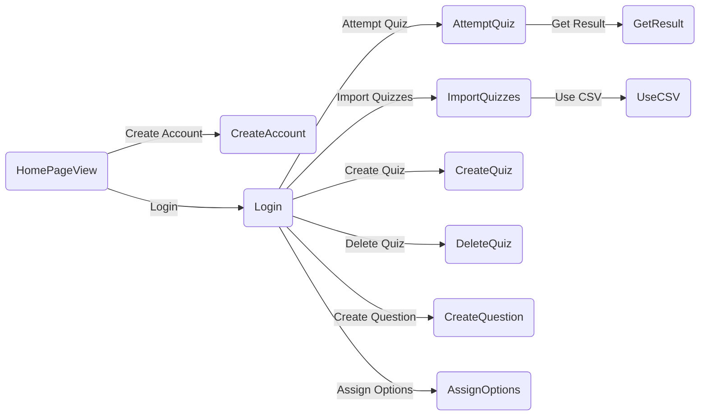
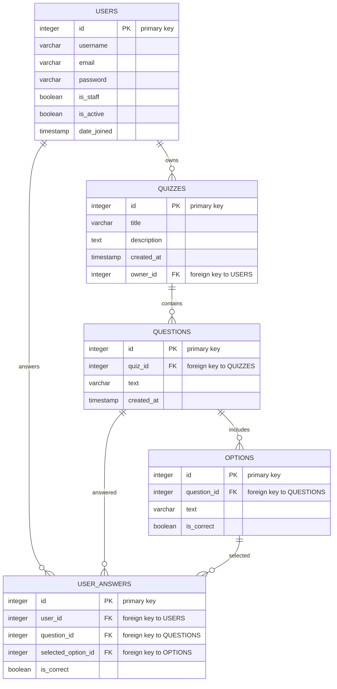

# Quiz App Project: Quizzy

## Graphical Abstract
### Flow:

### Data Structure:

## Demo
#TODO

[Demo Web APP](http://getbackwork.pythonanywhere.com/quiz)

## Purpose of the Software
Quizzy is designed as a personal practice tool for users preparing for various tests. The objective is to provide a simple yet efficient way to create, practice, and evaluate quizzes to enhance learning and test preparation.

### Software Development Process Applied
- **Waterfall Model**: We chose the Waterfall model for its straightforwardness and structured approach, which is conducive to the small scale and well-defined scope of our project.

### Why This Type?
- The Waterfall model allows our team to focus on a thorough requirement analysis and extensive planning at the early stages, ensuring a solid foundation for the rest of the project. Given that our app has a clear set of requirements with a predictable outcome, the sequential design of the Waterfall model suits our needs perfectly.

### Possible Usage
- **Target Market**: Our primary users are students and professionals looking for an effective way to prepare for exams or test their knowledge in specific subjects. Quizzy can be used for self-assessment or in a study group as a collaborative learning tool.

## Software Development Plan

### Development Process
The project is divided into distinct phases in line with the Waterfall model: Requirements, Design, Implementation, Verification, and Maintenance. 

### Members
- **Kenny Kou (P2204712)**: Configuring views and urls and models for the app.
- **Alex Leong (P2204876)**: Configuring templates,graphical abstract,ideas for future plan section
- **Matthew NG (P2204935)**: Responsible for demo video editing,providing help on configuring templates and future plan.

### Schedule
- **Day 1**: System design and architecture planning.
- **Day 2~3**: Implementation of core functionalities.
- **Day 4**: Testing and debugging.
- **Day 5**: Final review and project wrap-up.

### Algorithm
The core algorithm handles quiz creation, option selection, and scoring. It ensures that quizzes are created efficiently, answers are recorded accurately, and scores are calculated correctly.

### Current Status
The backend for quiz and question creation is complete. Frontend design and the import functionality for quizzes are testing.

### Future Plan
1. In the future, we plan to introduce a listening test feature and will support the uploading of MP3 files.
2. We will add a scoreboard feature that will display online rankings publicly, including names, usage time, date, and rank.
3. For individual users, we will add a test record feature to make it easy for users to look up their mistakes.
4. In terms of user creation, we will add more levels, such as 'teacher', 'student', etc.
5. We will add a database to create a public question bank, allowing each user to upload 1-5 question files.
6. We will add a feature in the question settings to randomize the order of the questions and the number of questions to be answered.
