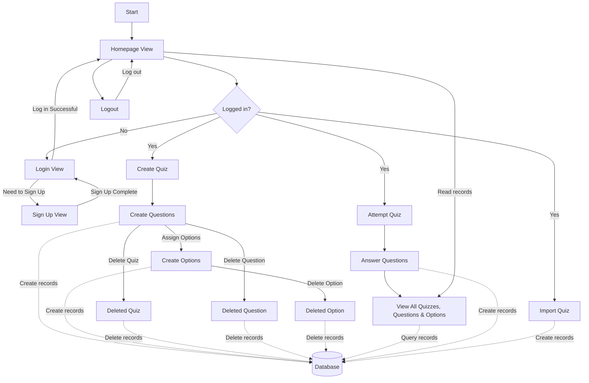
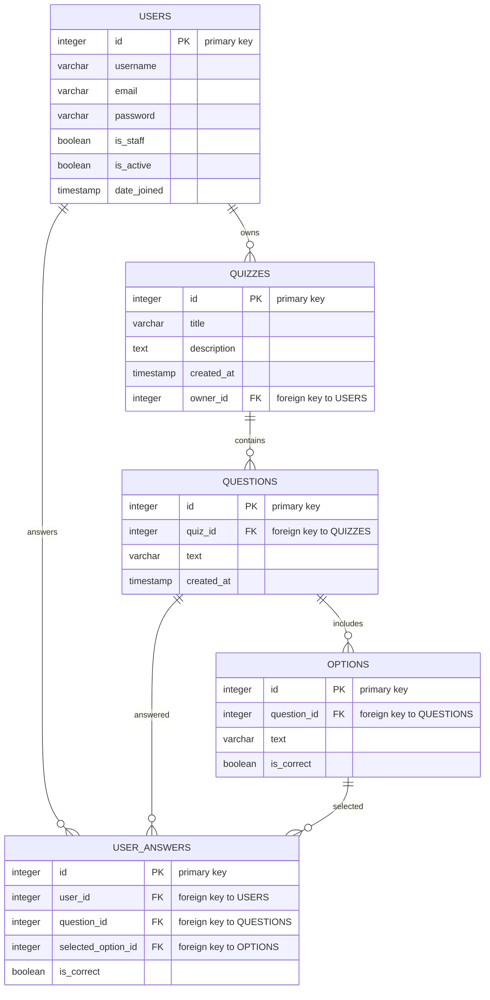

# Quizzy: Your Ultimate Quiz Preparation Tool 📚✨

    

## Graphical Abstract 🎨
### Flow:

**Feeling puzzled about preparing for your exams? Say goodbye to confusion with Quizzy, the charming practice buddy designed to make your test prep as easy as pie!** 🍰

## 🚀 Getting Started
Curious to dive in? Take a peek at Quizzy in action. Just hop over to ➔ [Demo Web APP](http://getbackwork.pythonanywhere.com/quiz)

## 📺 Video Demo
Want to see Quizzy in action? Check out this demo video ➔ [Video Demo](https://www.youtube.com/watch?v=aXe6G1CYO94&ab_channel=COMP223-classA-Quizzy)

## 🎯 Purpose
**Quizzy** is not just a tool; it's your personal cheerleader- ensuring you're sprint-ready for any test coming your way. Whether it's acing your school exams or smashing that professional certification, Quizzy's got your back!

## 💧 Software Development Process: The Classic Waterfall Model
We embraced the time-honored Waterfall model, valuing its linear, cascading essence which aligns with our crisp and clear project outline.

### Why Waterfall? Here's the splash!
* Structured and Steady: With a robust foundation phase and methodical overhead, we're on track to create Quizzy magic without any hitches.
* A predictable playbook: No room for guesswork or improvisation, we're sticking to the script to craft an outstanding quiz experience for you.

## 🎯 Target Market Snapshot
From bustling students to career-boosting professionals, Quizzy is the perfect prep companion for anyone with an appetite for knowledge and a hunger for success.

## 🛠️ Software Development Saga

### The Creation Odyssey
Following the Waterfall's legacy, we delved through stages from contemplation to realization:
* **Blueprinting Dreams:** Sculpting out Quizzy's DNA from authentication marvels to progress tracking victories.
* **Artful Designing:** Choreographing a symphony of screens and data dances, enriching Django's soul with our very own models and view masterpieces.
* **Crafting the Core:** Breathing life into Quizzy with the real deal - CRUD spells, question conjurations, and CSV enchantments.
* **Testing Triumphs:** Sending Quizzy through trials and tribulations with our rigorous test alchemists ensuring everything is tickety-boo.
* **Global Unveiling:** Setting the stage with servers, database glam, and static showstoppers, we're red-carpet ready for Quizzy's grand entrance.

### The Visioneers
Here's to the dream weavers behind Quizzy:
* **Kenny Kou (P2204767)**: The code whisperer for views, urls, and models.
* **Matthew NG (P2204935)**: The creative crusader for designing templates that aren't just visually pleasing but also intuitively navigable.
* **Alex Leong (P2204876)**: The maestro of demos, graphic and documents, a support hero, and a visionary for now, then and tomorrow's Quizzy.

### The March of Progress
* **Day 1:** Conceiving the grand design.
* **Day 2~3:** Breathing life into the creation.
* **Day 4:** Triumphing over bugs and glitches.
* **Day 5:** The final review; a toast to completion.

### Algorithm
#### Overall:

#### Data Structure:

### Progress Pulse
Backend brilliance ready! Frontend finery and quiz-importing alchemy in the test crucible.

### 🌟 Future Flashes
Tomorrow's Quizzy shines with features unheard and unseen:
* 🎧 Audio adventures with MP3 trails.
* 🏆 Scoreboard spectacles flaunting online glories.
* 📚 Test records unraveling the mysteries of knowledge.
* 🎭 User avatars ranging from wisdom-imparting teachers to knowledge-seeking students.
* 🏦 The treasure trove of a public question vault.
* 🔀 A merry-go-round of questions; neither knowing start nor end.
* 📱 Device dances, ensuring a sway-friendly Quizzy.
* 🔒 Fortified bastions guarding the sanctity of your Quizzy journey.

## 🤝 Environments of Software Development and Running

### Programming Language:

- **Backend**: Python with the Django framework.
- **Frontend**: HTML and CSS for a dynamic and responsive user interface.

### Minimum Hardware Requirements:

- **Processor**: 1 GHz or faster recommended.
- **RAM**: At least 512 MB, with 2 GB recommended.
- **Storage**: Minimum 100 MB of free space for Django, plus additional space for project data.

### Minimum Software Requirements:

- **Operating System**: Compatible with Windows, MacOS, Linux.
- **Python**: Version 3.7 or newer, up to Python 3.9.
- **Django**: 3.2.
- **Web Browser**: Latest version of popular browsers like Chrome, Firefox, Safari, or Edge.
- **Database**: SQLite, included with Django.

### Required Packages:

- `Django==3.2`
- `djangorestframework` (optional, for API functionality)
- `django-import-export` (for CSV import/export functionalities)

## Hosting:

Quizzy is hosted on [PythonAnywhere](https://www.pythonanywhere.com/), an online platform that makes it easy to set up and manage a Python-based web application. This service provides a hassle-free environment for running Quizzy without dealing with system-specific setup procedures.

## Declarations

### Dependencies Not Developed by the Team:

- **Django 3.2**: An open-source web framework used for backend development in Python.
- **SQLite**: A relational database management system contained in a C library that provides a self-contained, serverless, zero-configuration, transactional SQL database engine.

## Conclusion

Inspired to streamline the learning process, Quizzy is your go-to platform for interactive and effective quiz preparation. Join us on your quest for knowledge, and keep an eye out for forthcoming features and enhancements that will elevate your study sessions!
